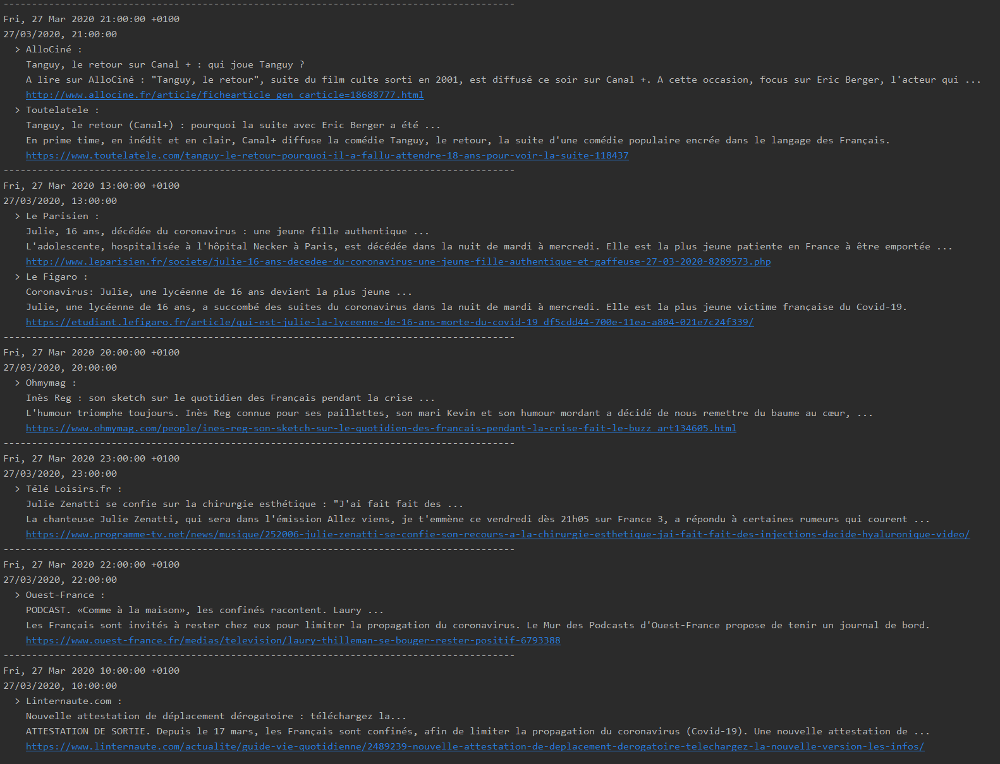

# Trend Keywords
Small script to ask google for the latest trend keywords, and convert the news
to a simple text file that you can send by mail or SMS.

Just launch `python3 main.py` and it should work.

